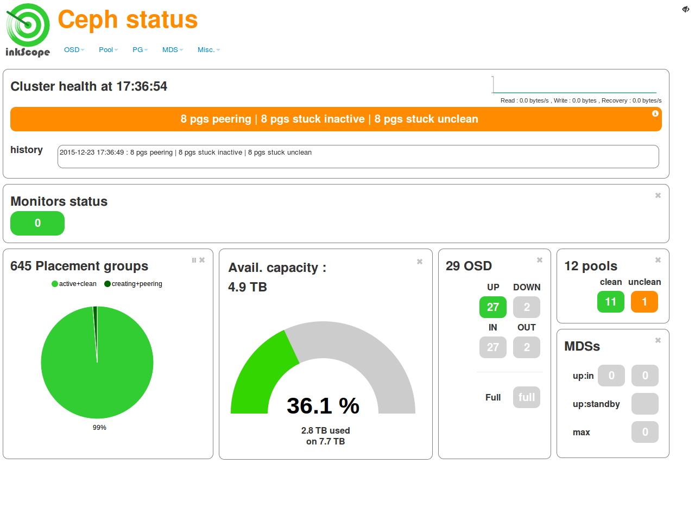
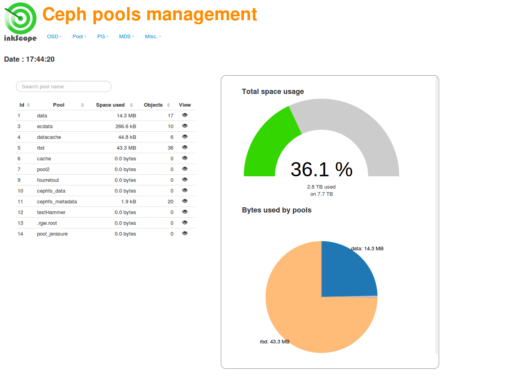
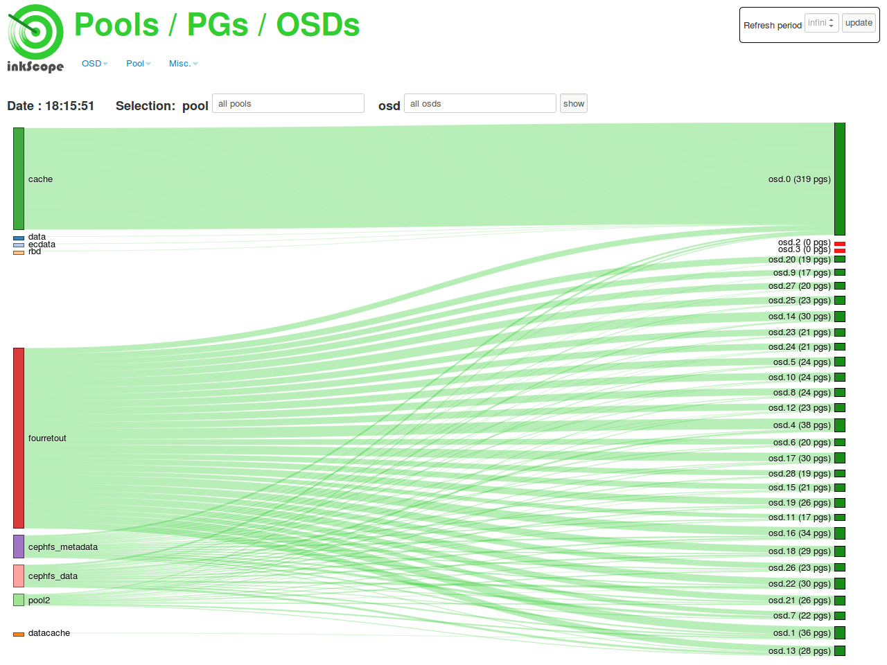
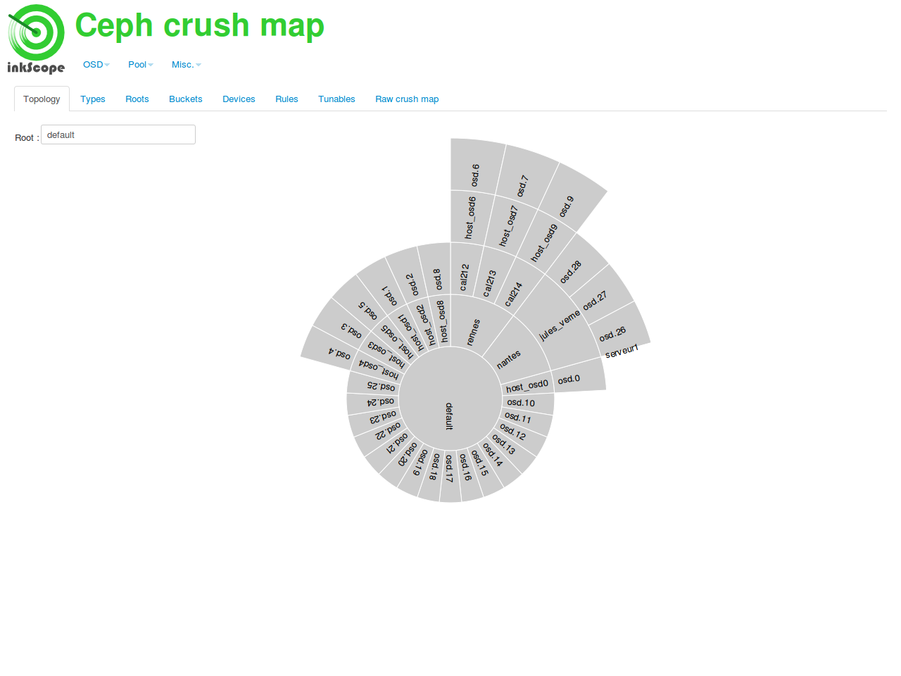

inkScope-lite
=============

InkScope-lite is a simplified version of [inkScope](https://github.com/inkscope/inkscope), a Ceph admin user interface.

It allows only visualization of a Ceph cluster.

It doesn't use probe or database but only the ceph-rest-api to communicate with Ceph.

# prequisites
Inkscope needs [Apache 2](http://httpd.apache.org/) et a running ceph-rest-api on the Ceph cluster.

Download all the directories of the inkScope-lite project to a folder of your choice

_in the following stages, we have chosen /var/www/inkscope-lite_

# Installation

## Installation of inkscope-lite

Apache V2 is already installed

1. Choose a tcp port for inkscope-lite

    *in the following stages, we have chosen 8080*

1. Modify Apache conf file /etc/apache2/port.conf to add the following line

        Listen 8080

1. Create a virtual host named **inkscope-lite**

    in the folder */etc/apache2/sites-available* ,
    create a file *inkscope-lite.conf* with this content:

        <VirtualHost *:8080>
            ServerName  localhost
            ServerAdmin webmaster@localhost

            DocumentRoot {inkscope-lite_folder}
            <Directory "{inkscope-lite_folder}">
                Options All
                AllowOverride All
                Require all granted
            </Directory>

            ErrorLog ${APACHE_LOG_DIR}/error.log

            # Possible values include: debug, info, notice, warn, error, crit,
            # alert, emerg.
            LogLevel warn

            ProxyRequests Off  # we don't want a "forward proxy", but only a "Reverse proxy"
            ProxyPass /ceph-rest-api/ {ceph_rest_api_url}

            CustomLog ${APACHE_LOG_DIR}/access.log combined
        </VirtualHost>

    Be sure to modify *{inkscope-lite_folder}* and *{ceph_rest_api_url}* with the appropriate values

1. Enable proxy module in Apache (if not already enabled)

        sudo a2enmod proxy_http
        sudo service apache2 restart

1. Enable inkscope-lite virtual host:

        sudo a2ensite inkscope-lite

    No need to restart Apache

#Screenshots

